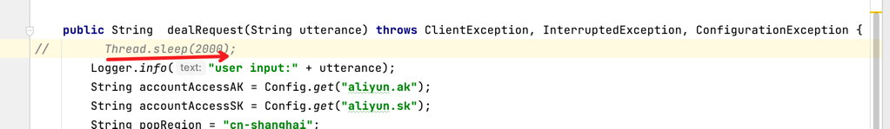

# 项目介绍
初学java，尝试实现一个支持高并发的socket server。

项目借助阿里云的智能对话机器人,实现client和server多轮对话效果。

## 产品效果
https://www.zhihu.com/zvideo/1496615880427048960
1. socket server可同时处理多个客户端请求
2. 多轮交互的对话机器人

# 实现

## 机器人对话
代码 `BeeBot.java`

阿里云产品链接：https://www.aliyun.com/product/beebot
## socket client

## socket server

### 方案一：基于java nio，支持同时处理多客户端请求
代码 `NioServer.java`

特点：

1、异步IO，等待IO数据时，不会阻塞server。

2、当触发IO事件后，任务执行（这里就是调用阿里云接口，和机器人对话）环节，是单线程。

这个模型和redis的线程模型很像，单线程异步IO。

这个模型的缺点是：
任务执行这块，不能耗时太长。

比如，我们都知道redis不能有大key操作，即单任务处理耗时如果过长，
就会阻塞接下来的任务，导致服务超时。

#### 此方案效果展示：
下面通过视频演示下这个方案的缺点：

为了展示效果更有区分度，我们故意在机器人对话环节，多sleep 2秒。

这样client和server交互一次耗时大概是2s多。
视频链接：
https://www.zhihu.com/zvideo/1496615883905101824

我们启动多个client，同时给服务器发送请求，可以看到，**服务器处理一次请求耗时在2-6s之间**。

原因就在于我们的server是单线程的。虽然IO是异步的，但是任务还是要一个个同步执行。

为了改进这个缺陷，我尝试了下述方案二。

### 方案二：基于java nio和线程池，实现高性能socket server
代码 `NioThreadPoolServer.java`

#### 此方案效果展示：
视频链接：https://www.zhihu.com/zvideo/1496615874719543296

在此方案中，我们启动多个client，同时给服务器发送请求，可以看到，**服务器处理一次请求耗时都在2s多**，彼此互无影响。

